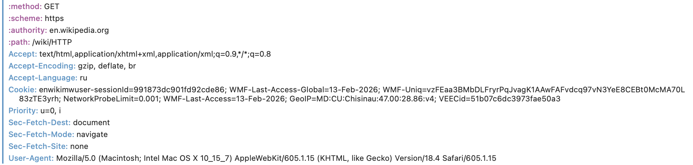
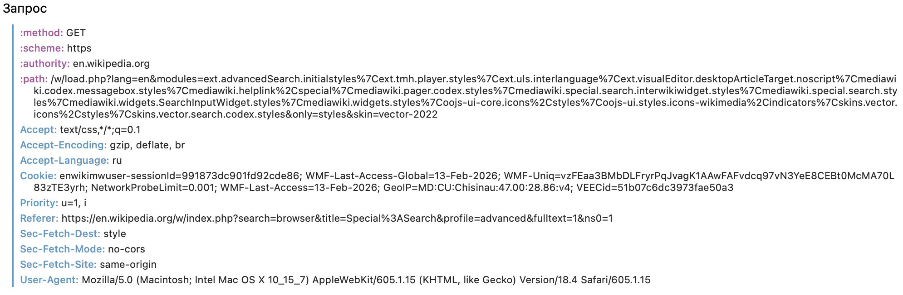
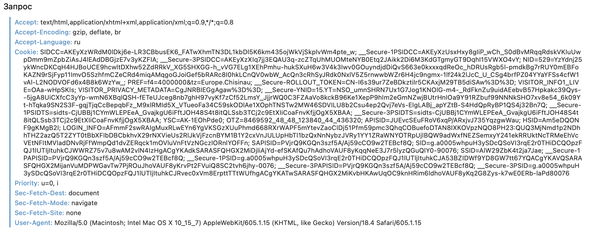

# Лабораторная работа 1
## Тема : HTTP
### Задание 1. Анализ HTTP-запросов. Часть 1
**URl** - https://en.wikipedia.org/wiki/HTTP
**Method** - GET, это метод получения страницы
**Статус** - 200(ОК) - статус страницы показывает, как сервер обработал запрос: успешно, с ошибкой или с перенаправлением.
**Заголовки** - это данные, которые браузер отправляет серверу при обращении к странице.
 *Заголовки запроса передают серверу информацию о клиенте и параметрах запроса, а заголовки ответа информируют браузер о типе данных, статусе выполнения запроса, правилах кэширования и безопасности соединения. Они являются важной частью протокола HTTP и обеспечивают корректное взаимодействие между клиентом и сервером.*
**Запросы** - -CSS-файлы — для оформления страницы (цвета, шрифты, расположение элементов).
JavaScript-файлы — для обеспечения интерактивности и динамической работы сайта.
Изображения — логотипы, иконки, иллюстрации.
Шрифты — для корректного отображения текста.
API-запросы — для получения дополнительных данных или обновления элементов страницы.
Файлы кэширования и аналитики — для ускорения загрузки и сбора статистики.

По ссылке **https://en.wikipedia.org/wiki/HTTPdsfdfs** - статус ответа был 404, что означает ошибку, сервер не загрузил эту страницу, потому что ее не существует. 

### Задание 2. Анализ HTTP-запросов. Часть 2
**URl** - https://en.wikipedia.org/w/index.php?**search=browser**+intitle%3Abrowser&title=Special%3ASearch&profile=advanced&fulltext=1&advancedSearch-current=%7B%22fields%22%3A%7B%22plain%22%3A%5B%22browser%22%5D%2C%22intitle%22%3A%22browser%22%7D%7D&ns0=1
**Method** - GET для получения данных с сервера.
**Query Parameters** - `search` `browser intitle:browser`	Основной поисковый запрос, введённый пользователем
`title`	`Special:Search`	Указывает, что выполняется поиск на специальной странице поиска Wikipedia
`profile`	`advanced`	Используется для расширенного поиска (advanced search)
`fulltext`	`1`	Поиск по всему тексту статей, а не только по заголовкам
`advancedSearch-current`	`{"fields":{"plain":["browser"],"intitle":"browser"}}`	JSON-код с информацией о текущих полях расширенного поиска (текст и заголовок)
`ns0`	`1`	Пространство имён, в котором выполняется поиск (ns0 = статьи)

### Задание 3. Анализ HTTP-запросов. Часть 3
**YouTube** 
1. URL -  https://www.youtube.com/
2. Статус - 200

### Задание 4. Составление HTTP-запросов
1. **GET** : 
GET / HTTP/1.1
Host: sandbox.usm.com
User-Agent: Artem Sigal
**User-Agent** — это заголовок HTTP-запроса, который браузер (или другое приложение) отправляет серверу.
2. **Post** :
POST /cars HTTP/1.1
Host: sandbox.usm.com
Content-Type: application/json
Content-Length: 58

{
 "make": "Toyota",
 "model": "Corolla",
 "year": 2020
}
#### HTTP-методы : 
**GET** — получение данных
**POST** — создание ресурса
**PUT** — полное обновление ресурса
**PATCH** — частичное обновление ресурса
**DELETE** — удаление ресурса
**HEAD** — как GET, но без тела ответа
**OPTIONS** — какие методы разрешены
**CONNECT** — создание туннеля (HTTPS)
**TRACE** — диагностика запроса

3. **PUT** : 
PUT /cars/1 HTTP/1.1
Host: sandbox.usm.com
User-Agent: Artem Sigal
Content-Type: application/json
Content-Length: 58

{
 "make": "Toyota",
 "model": "Corolla",
 "year": 2021
}
#### PUT и PATCH :
**PUT** — полностью заменяет ресурс (если не указать поле — оно удалится)
**PATCH** — изменяет только переданные поля (остальные остаются без изменений)

4. **Ответ** :
HTTP/1.1 201 Created
Content-Type: application/json
Content-Length: 45

{
 "id": 5,
 "message": "Car created successfully"
}
#### Когда сервер может вернуть разные коды
**200 OK**
Если запись успешно создана и сервер возвращает подтверждение без создания нового ресурса.
**201 Created**
Если создан новый ресурс (новая машина добавлена).
**400 Bad Request**
Если: данные переданы в неправильном формате
отсутствует обязательное поле неверный JSON
**401 Unauthorized**
Если требуется авторизация, но пользователь не вошёл в систему.
**403 Forbidden**
Если пользователь авторизован, но не имеет прав создавать записи.
**404 Not Found**
Если адрес /cars не существует на сервере.
**500 Internal Server Error**
Если произошла ошибка на сервере (например, сбой базы данных).